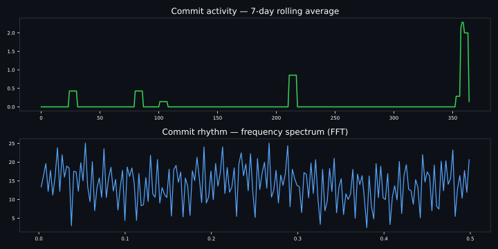

<h1 align="center">Hi there, I'm Jeevan 👋</h1>
<h3 align="center">A passionate coder from India, endlessly curious about everything</h3>

  

  
  

  
  
  

---

### 🛠️ Languages & Tools

  
  
  
  
  

---

### 📊 GitHub Analytics

<table style="width: 100%; background-color: #1e1e1e; color: white; table-layout: fixed;">
  <thead>
    <tr>
      <th colspan="2" align="center">
        
      </th>
    </tr>
  </thead>
  <tbody>
    <tr>
      <td style="padding: 20px; text-align: center;">
        
      </td>
      <td style="padding: 20px; text-align: center;">
        
      </td>
    </tr>
    <tr>
      <td colspan="2" style="padding: 20px; text-align: center;">
        
      </td>
    </tr>
    <tr>
      <td colspan="2" style="padding: 20px; text-align: center;">
        
      </td>
    </tr>
  </tbody>
</table>

---

  

---

  <i>"The best way to predict the future is to compute it." — powered by curiosity, caffeine, and the occasional stack overflow tab.</i>

<!---
pallejeevan24/pallejeevan24 is a ✨ special ✨ repository because its `README.md` (this file) appears on your GitHub profile.
You can click the Preview link to take a look at your changes.
--->
